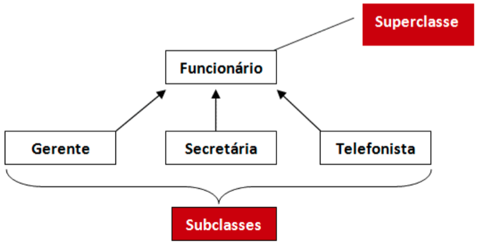
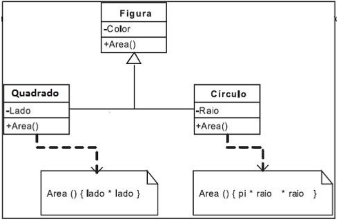

# php

### Exercício 1 ###
Crie um algoritmo que imprima a tabuada de um número.
```php
function imprimeTabuada(int $num){
     for($i = 1; $i <= 10; $i++){
         echo "$num x $i = ". ($num * $i) . "<br>"; 
     }
}
```

### Exercício 2 ###
Crie um algoritmo que calcule a média de um array com 10 elementos
```php
 function average(array $arr)
    {
        $count = count($arr);
        $sum = 0;
        for($i = 0; $i < $count; $i++){
            $sum += $arr[$i];
        }
        return $sum / $count; 
    }

    $arr = [10, 10, 10, 10, 10, 10, 10];
    echo "A média final de " . implode(", ", $arr) . " é de ". average($arr);
 ```

### Exercício 3 ###
Crie um algoritmo que entre com uma palavra e imprima conforme o exemplo
◦ Palavra: PHP
- PHP
- PHP PHP
- PHP PHP PHP
- PHP PHP PHP PHP
```php
    function writeInLists(string $word, int $n_vezes) {
        for($i = 1; $i <=$n_vezes; $i++){ //linhas
           for($j = 0; $j < $i; $j++){ // colunas
               echo $word." ";
           } 
           echo '<br>';
        }
    }
    writeInLists("PHP", 4);
```

### Exercício 4 ###
O Chico tem 1,50m e cresce 2 centímetros por ano, enquanto Juca tem 1,10m e cresce
3 centímetros por ano. Construa um algoritmo que calcule e imprima quantos anos
serão necessários para que Juca seja maior que Chico.
```php
     $chico = 1.5;
     $juca = 1.1;
     $anos = 0;
    
     while($juca < $chico){
         $juca += 0.03;
         $chico += 0.02;
         $anos++;
         //echo "Ao fim de $anos o chico tem $chico m e o juca tem $juca m<br>";
     }
 
     echo "O Juca é maior que o chico ao fim de $anos anos";
  ```

### Exercício 5 ###
Criar um algoritmo com uma matriz 5x5 e escreva os elementos da diagonal principal.
```php
     $matriz = [
        [0, 2, 3, 4, 5],
        [1, 0, 3, 4, 5],
        [1, 2, 0, 4, 5],
        [1, 2, 2, 0, 5],
        [1, 2, 3, 4, 0]
    ];
     
    for($l = 0; $l < 5; $l++){ // linhas
        for($c = 0; $c < 5; $c++){ // colunas
            if($l == $c){
                echo $matriz[$l][$c];
            }else{
                echo "X";
            }
        }
        echo "<br>";
    }
```
### Exercício 6 ###
Crie um algoritmo que ordene um array de 10 inteiros pelo seu valor do mais pequeno
para o maior. (sem usar as funções de sort de arrays)
```php
$a = [0, 55555, 10, 9, 325, 0, 8, 564, -7, 32132];
    function customSort(array &$array){
        for($i = 0; $i < count($array); $i++){
            for($j = $i; $j < count($array); $j++){
                if($array[$i] > $array[$j]){
                    $temp = $array[$i];
                    $array[$i] = $array[$j];
                    $array[$j] = $temp;
                }
                // echo "i = $i j = $j"; 
                // print_r($array);
            }
            // echo "<hr>";
        }
    }

    print_r($a);
    customSort($a);
    print_r($a);
```

### Exercício 7 ###
A) Crie um algoritmo que verifique se uma palavra é palíndromo (que tenha a propriedade
de poder ser lida tanto da direita para a esquerda como da esquerda para a direita)

Ex: ANA, osso, RADAR, SAIAS

NOTA: para dividir uma string num array de caracteres pode usar a função nativa str_split()
Doc: https://www.php.net/manual/en/function.str-split.php

### Exercício 8 ###
Crie uma função que verifique se um numero é par

### Exercício 9 ###
Crie uma função que receba 2 numeros inteiros e escreva o resultado da soma, subtraçao, divisão e multiplcação desses 2 numeros.

### Exercício 10 ###
Crie uma função que receba um array de inteiros e que devolva o número de numeros pares presentes no array

### Exercício 11 ###
Crie uma função que calcule e imprima os primeiros 10 numeros da sequencia Fibonaci.
```php
    function fibonaci($limit){
        $n = 0;
        $n1= 1;
        for($i = 0; $i < $limit; $i++){
            echo $n ." - ";
            $aux = $n + $n1;
            $n = $n1;
            $n1 = $aux;
            
        }
    }

    fibonaci(13);
    
    // OU usando recursividade
    
    function fibonaci($n, $n1, $limit){
        if($limit > 0){
            echo $n ." - ";
            $aux = $n + $n1;
            fibonaci($n1, $aux, --$limit);
        }
    }

    fibonaci(0,1,13);
    
```

### Exercício 12 (para fazer em casa) ###
Crie uma função que percorra uma matriz (5x5) de zeros e uns, e considerando o número 1 como vivo e o número 0 como morto aplique as sequintes regras:

se vivo e 2 ou 3 vizinhos vivos -> mantêm-se vivo<br>
                        else -> morto
                        
se morto e 3 vizinhos vivos -> fica vivo<br>
                       else -> morto

EX:

INPUT<br/>
0 0 0 0 0<br/>
0 0 1 0 0<br/>
0 0 1 0 0<br/>
0 0 1 0 0<br/>
0 0 0 0 0<br/>
     
OUTPUT<br/>
0 0 0 0 0<br/>
0 0 0 0 0<br/>
0 1 1 1 0<br/>
0 0 0 0 0<br/>
0 0 0 0 0<br/>

### Exercício 13 ###
Usando a base de dados na pasta users_CRUD crie um formulário de login que receba username e password e valide os dados na base de dados de utilizador na base de dados.

https://github.com/flagbackendLT67619/flag_saude_php/commit/0bcc69440842fb3f4552d8d2d1fee074885a475e

### Exercício 14 ###
Usando a base de dados na pasta users_CRUD liste todos os utilizadores ( mostre os dados numa tabela )

https://github.com/flagbackendLT67619/flag_saude_php/commit/0bcc69440842fb3f4552d8d2d1fee074885a475e

### Exercício 15 ###
Usando a base de dados na pasta users_CRUD receba o id do user por query parameter e mostre o utilizador

https://github.com/flagbackendLT67619/flag_saude_php/commit/eac7d2890b22aca6c797d03e9fd402718d36f455

### Exercício 16 ###
Usando a base de dados na pasta users_CRUD receba o id do user por query parameter e edite os dados do utilizador.

### Exercício 17 ###
Depois do login com sucesso crie uma sessão para e guarde o campo autenticado = true nesse utilizador.
Use a sessão para verificar se o utilizador pode navegar no conteúdo privado.

https://github.com/flagbackendLT67619/flag_saude_php/commit/1b11541f3020703ae4c3b4c26ab4f4c709551659

### Exercício 18 ###
Crie o esquema de classes abaixo indicado usando herança.


### Exercício 19 ###
Crie o esquema de classes abaixo indicado usando herança e polimorfismo de modo a que seja possivel calcular a area de cada um dos objectos.


### Exercício 20 ###
 - Volte ao exercício 18 e implemente um metodo para imprimir o salario de cada tipo de funcionário, considerando que a forma de calculo é diferente para todos.
 - Considere que o Funcionário não deverá ser instânciado e que o valor base (630€) é igual para todos os funcionários.
 - Forma de calculo :
     - gerente: valor_base + 20€ * n_dias de_trabalho
     - secretaria: valor_base + 10€ * n_dias de_trabalho
     - telefonista: valor_base + 5€ * n_vendas_feitas